# Abstract

This research attempts to answer the question of whether California Charter Schools are better than California Public schools, by evaluating the relative performance of charter schools and public schools in the areas of chronic absenteeism rate, college going rate, dropout rate, suspension rate and graduation rate. 

For this research, the primary methodology for answering this question is by calculating the means for charter schools and public schools across each of the independent variables, and then using a t-test to determine if there is statistical evidence to support the hypothesis that the difference between charter schools and public schools is statistically significant at a 95% level of significance. Next, for those in which there is a statistical difference between the two groups, we will give a point to the school type with the better performance for each measure. Finally, we will determine which school type is better, based on the school type with the most points out of 5 possible points.

As a result of this analysis, we found that Charter Schools' performed better than Public Schools in the areas of suspension rate and chronic absenteeism rate, while public did not out perform charter schools in any of the areas, thus resulting in us concluding that charter schools - based on this methodology - are better than public schools. 


# Introduction

For this project, we will explore data from the [California Department of Education](https://www.cde.ca.gov/ds/ad/downloadabledata.asp) in an effort to determine if there is a statistically significant difference between charter schools and public shools. We will compare the schools in the state across a few key measurements:

- Graduation Rates
- College Admission Rates
- Suspensions
- Dropout Rates
- Absenteeism

The methodology for this analysis will be as follows:

**Methodology:**
1. Create dataframe by combining data files from the Department of Education website
2. Combine the various datasets into a singular data file
3. Calculate the core metrics
4. Answer the questions across each of the different areas
5. Create visualizations to correspond with the questions at hand
6. Answer the questions of interest
7. Write the conclusion

Furthermore, the documentation for each of the datasets are located here
1. Public Schools and Districts - https://www.cde.ca.gov/ds/si/ds/fspubschls.asp
2. Chronic Absenteeism - https://www.cde.ca.gov/ds/ad/fsabd.asp
3. Suspensions - https://www.cde.ca.gov/ds/ad/fssd.asp
4. Dropout - https://www.cde.ca.gov/ds/ad/fsacgr.asp
5. Post-Secondary Enrollment - https://www.cde.ca.gov/ds/ad/fscgr16.asp


# Setup

We begin by setting an autosave parameter in Jupyter Notebooks, to save us from losing our data. From there we will import the various libraries needed for different uses across our project.


```python
%autosave 120
```


    Autosaving every 120 seconds


```python
import pandas as pd
import numpy as np
import matplotlib.pyplot as plt
import seaborn as sns
import re
from numpy.random import seed
from numpy.random import randn
from numpy.random import normal
from scipy.stats import ttest_ind
from matplotlib import rcParams

pd.set_option('display.max_columns', None)
```

# Import Data

We start by importing the raw data directly from the California Department of Education website, and then making a copy of the dataframe so that we have an untouched version of the data available if we need to revert at any time.


```python
schools_df_raw = pd.read_csv('https://www.cde.ca.gov/schooldirectory/report?rid=dl1&tp=txt', sep='\t')
susp_df_raw = pd.read_csv('https://www3.cde.ca.gov/demo-downloads/discipline/suspension22-v2.txt',encoding = "ISO-8859-1", sep='\t')
grads_df_raw = pd.read_csv('https://www3.cde.ca.gov/demo-downloads/acgr/acgr22-v2.txt', sep='\t')
ca_df_raw = pd.read_csv('https://www3.cde.ca.gov/demo-downloads/attendance/chronicabsenteeism22-v2.txt', sep='\t', encoding = "ISO-8859-1")
cgr_df_raw = pd.read_csv('https://www3.cde.ca.gov/demo-downloads/cgr/cgr16mo20.txt', sep='\t')
```


```python
schools_df = schools_df_raw.copy()
susp_df = susp_df_raw.copy()
grads_df = grads_df_raw.copy()
ca_df = ca_df_raw.copy()
cgr_df = cgr_df_raw.copy()
```

# Data Wrangling

To start, I need to develop the data frames that will be used for the data analysis. This will be a combination of the different dataframes downloaded above and the common key will be the CDS Code. 

We will create sub dataframes that only contain the data we desire after completing some pre-processing steps on the individual dataframes. 

One common practice that I've done (I will eventually turn this into a function in a library for continued use), is to convert columns names into lower_case_format with underscores. I do this for each of my sub dataframes. 

#### A. Schools Directory Data Frame


```python
schools_mini = schools_df.copy()
```


```python
new_columns = []
column_names = schools_mini.columns.to_list()
for column in column_names:
    words = re.findall(r'[A-Z]+[a-z]*',column)
    lower_case_words = [word.lower() for word in words]
    new_column = '_'.join(lower_case_words)
    new_columns.append(new_column)

schools_mini.columns = new_columns
```


```python
schools_mini.columns
```


    Index(['cdscode', 'ncesdist', 'ncesschool', 'status_type', 'county',
           'district', 'school', 'street', 'street_abr', 'city', 'zip', 'state',
           'mail_street', 'mail_str_abr', 'mail_city', 'mail_zip', 'mail_state',
           'phone', 'ext', 'fax_number', 'email', 'web_site', 'open_date',
           'closed_date', 'charter', 'charter_num', 'funding_type', 'doc',
           'doctype', 'soc', 'soctype', 'ed_ops_code', 'ed_ops_name', 'eilcode',
           'eilname', 'gsoffered', 'gsserved', 'virtual', 'magnet',
           'year_round_yn', 'federal_dfcdistrict_id', 'latitude', 'longitude',
           'adm_fname', 'adm_lname', 'adm_email', 'last_up_date'],
          dtype='object')


```python
schools_mini = schools_mini[['cdscode','status_type','county','district','school','charter','eilcode']].copy()
```


```python
schools_mini.loc[:,'cdscode'] = schools_mini['cdscode'].astype(str)
```

#### B. Suspensions Data Frame

1. Update CountyCode, DistrictCode, SchoolCode to characters
2. Create a CDS code based on these values
3. Create a sub_df for the suspensions


```python
susp_mini = susp_df.copy()
```


```python
new_columns = []
column_names = susp_mini.columns.to_list()
for column in column_names:
    words = re.findall(r'[A-Z]+[a-z]*',column)
    lower_case_words = [word.lower() for word in words]
    new_column = '_'.join(lower_case_words)
    new_columns.append(new_column)

susp_mini.columns = new_columns
```


```python
susp_mini.columns
```


    Index(['academic_year', 'aggregate_level', 'county_code', 'district_code',
           'school_code', 'county_name', 'district_name', 'school_name',
           'charter_yn', 'reporting_category', 'cumulative_enrollment',
           'total_suspensions', 'unduplicated_count_students_suspended_total',
           'unduplicated_count_students_suspended_defiance_only',
           'suspension_rate_total', 'suspension_count_violent_incident_injury',
           'suspension_count_violent_incident_no_injury',
           'suspension_count_weapons_possession',
           'suspension_count_illicit_drug_related',
           'suspension_count_defiance_only', 'suspension_count_other_reasons'],
          dtype='object')


```python
susp_mini = susp_mini[(susp_mini['aggregate_level'] == 'S') &
(susp_mini['reporting_category'] == 'TA')].copy()
```


```python
susp_mini.loc[:,['county_code','district_code','school_code']] = susp_mini[['county_code','district_code','school_code']].astype(int).astype(str)
```


```python
susp_mini.loc[:,'cdscode'] = susp_mini.apply(lambda x: x['county_code']+ 
                                             x['district_code']+
                                             x['school_code'], axis=1)
```


```python
susp_mini.rename(columns={'suspension_rate_total':'suspension_rate'},inplace=True)
```


```python
susp_mini = susp_mini[['cdscode', 'suspension_rate']].copy()
```


```python
susp_mini.shape
```


    (10652, 2)


#### C. Graduates and Dropouts Data Frame


```python
grads_mini = grads_df.copy()
```


```python
new_columns = []
column_names = grads_mini.columns.to_list()
for column in column_names:
    words = re.findall(r'[A-Z]+[a-z]*',column)
    lower_case_words = [word.lower() for word in words]
    new_column = '_'.join(lower_case_words)
    new_columns.append(new_column)

grads_df.columns = new_columns
```


```python
grads_mini = grads_df[(grads_df['aggregate_level'] == 'S') &
(grads_df['dass'] == 'All') &
(grads_df['reporting_category'] == 'TA') &
(grads_df['charter_school'] == 'All')].copy()
```


```python
grads_mini.shape
```


    (2776, 34)


```python
grads_mini.loc[:,['county_code', 'district_code', 'school_code']] = grads_mini[['county_code', 'district_code', 'school_code']].astype(int).astype(str)
```


```python
grads_mini.loc[:,'cdscode'] = grads_mini.apply(lambda x: x['county_code'] + 
                                               x['district_code'] + 
                                               x['school_code'],axis=1)
```


```python
grads_mini.rename(columns={'regular_hs_diploma_graduates_rate':'graduation_rate'},inplace=True)
```


```python
grads_mini = grads_mini[['cdscode','graduation_rate', 'dropout_rate']].copy()
```

#### D. Chronic Absenteeism Data Frame


```python
ca_mini = ca_df.copy()
```


```python
new_columns = []
column_names = ca_df.columns.to_list()
for column in column_names:
    words = re.findall(r'[A-Z]+[a-z]*',column)
    lower_case_words = [word.lower() for word in words]
    new_column = '_'.join(lower_case_words)
    new_columns.append(new_column)

ca_mini.columns = new_columns
```


```python
ca_mini.columns
```


    Index(['academic_year', 'aggregate_level', 'county_code', 'district_code',
           'school_code', 'county_name', 'district_name', 'school_name',
           'charter_school', 'reporting_category',
           'chronic_absenteeism_eligible_cumulative_enrollment',
           'chronic_absenteeism_count', 'chronic_absenteeism_rate'],
          dtype='object')


```python
ca_mini = ca_mini[(ca_mini['aggregate_level'] == 'S') &
(ca_mini['reporting_category'] == 'TA')].copy()
```


```python
ca_mini.loc[:,['county_code','district_code','school_code']] = ca_mini[['county_code','district_code','school_code']].astype(int).astype(str)
```


```python
ca_mini.loc[:, 'cdscode'] = ca_mini.apply(lambda x: x['county_code'] + 
                                     x['district_code'] + 
                                     x['school_code'], axis=1)
```


```python
ca_mini = ca_mini[['cdscode','chronic_absenteeism_rate']].copy()
```

#### E. Cohort Graduation Data Frame


```python
cgr_mini = cgr_df.copy()
```


```python
new_columns = []
column_names = cgr_df.columns.to_list()
for column in column_names:
    words = re.findall(r'[A-Z]+[a-z]*',column)
    lower_case_words = [word.lower() for word in words]
    new_column = '_'.join(lower_case_words)
    new_columns.append(new_column)

cgr_mini.columns = new_columns
```


```python
cgr_mini = cgr_mini[(cgr_mini['aggregate_level'] == 'S') &
(cgr_mini['reporting_category'] == 'TA') &
(cgr_mini['alternative_school_accountability_status'] == 'All') &
(cgr_mini['completer_type'] == 'TA') &
(cgr_mini['charter_school'] == 'All')].copy()
```


```python
cgr_mini.loc[:,['county_code',
                'district_code',
                'school_code']] = cgr_mini[['county_code','district_code','school_code']].astype(int).astype(str)
```


```python
cgr_mini.loc[:,'cdscode'] = cgr_mini.apply(lambda x: x['county_code'] + 
                                           x['district_code'] + 
                                           x['school_code'], axis=1)
```


```python
cgr_mini.rename(columns={'college_going_rate_total_months': 'college_going_rate'},inplace=True)
```


```python
cgr_mini = cgr_mini[['cdscode','college_going_rate']].copy()
```


```python
cgr_mini.shape
```


    (2380, 2)


#### f. Create Merged Data Frame

Here we are combining the separate category specific dataframes together to create an overall dataframe that allows us to connect the data with the school information


```python
m1 = pd.merge(schools_mini,susp_mini,how="left", on='cdscode')
m2 = pd.merge(m1,grads_mini,how='left', on='cdscode')
m3 = pd.merge(m2, ca_mini, how='left', on='cdscode')
m4 = pd.merge(m3,cgr_mini, how='left', on='cdscode')
```


```python
m4 = m4[m4['charter'] != 'No Data'].copy()
```


```python
m4.rename(columns={'eilcode':'school_level'},inplace=True)
```

In this step, we remove the school levels that are either non-existent for one of the school types (i.e. the values are NA) or that have only a couple entries in the data


```python
merged_df = m4[(m4['school_level'] != 'A') &
(m4['school_level'] != 'PS') &
(m4['school_level'] != 'UG')].copy()
```

Replace NA values with a -9999 sentinel value


```python
mask1 = merged_df['graduation_rate'].isna()
mask2 = merged_df['dropout_rate'].isna()
mask3 = merged_df['chronic_absenteeism_rate'].isna()
mask4 = merged_df['college_going_rate'].isna()
mask5 = merged_df['suspension_rate'].isna()
```


```python
merged_df.loc[mask1,'graduation_rate'] = -9999
merged_df.loc[mask2,'dropout_rate'] = -9999
merged_df.loc[mask3,'chronic_absenteeism_rate'] = -9999
merged_df.loc[mask4,'college_going_rate'] = -9999
merged_df.loc[mask5,'suspension_rate'] = -9999
```

Replace * values with -9999 sentinel value


```python
mask1 = merged_df['graduation_rate'] == '*'
mask2 = merged_df['dropout_rate'] == '*'
mask3 = merged_df['chronic_absenteeism_rate'] == '*'
mask4 = merged_df['college_going_rate'] == '*'
```


```python
merged_df.loc[mask1,'graduation_rate'] = -9999
merged_df.loc[mask2,'dropout_rate'] = -9999
merged_df.loc[mask3,'chronic_absenteeism_rate'] = -9999
merged_df.loc[mask4,'college_going_rate'] = -9999
```

Set the sentinal value for missing values to -9999


```python
merged_df[['suspension_rate','graduation_rate','dropout_rate',
          'chronic_absenteeism_rate','college_going_rate']] = merged_df[['suspension_rate','graduation_rate',
                                                                         'dropout_rate',
          'chronic_absenteeism_rate','college_going_rate']].astype(float)
```

# 4. Data Exploration


```python
merged_df.info()
```

    <class 'pandas.core.frame.DataFrame'>
    Int64Index: 13861 entries, 1 to 18305
    Data columns (total 12 columns):
     #   Column                    Non-Null Count  Dtype  
    ---  ------                    --------------  -----  
     0   cdscode                   13861 non-null  object 
     1   status_type               13861 non-null  object 
     2   county                    13861 non-null  object 
     3   district                  13861 non-null  object 
     4   school                    13861 non-null  object 
     5   charter                   13861 non-null  object 
     6   school_level              13861 non-null  object 
     7   suspension_rate           13861 non-null  float64
     8   graduation_rate           13861 non-null  float64
     9   dropout_rate              13861 non-null  float64
     10  chronic_absenteeism_rate  13861 non-null  float64
     11  college_going_rate        13861 non-null  float64
    dtypes: float64(5), object(7)
    memory usage: 1.4+ MB


```python
merged_df.describe()
```


<div>
<style scoped>
    .dataframe tbody tr th:only-of-type {
        vertical-align: middle;
    }

    .dataframe tbody tr th {
        vertical-align: top;
    }

    .dataframe thead th {
        text-align: right;
    }
</style>
<table border="1" class="dataframe">
  <thead>
    <tr style="text-align: right;">
      <th></th>
      <th>suspension_rate</th>
      <th>graduation_rate</th>
      <th>dropout_rate</th>
      <th>chronic_absenteeism_rate</th>
      <th>college_going_rate</th>
    </tr>
  </thead>
  <tbody>
    <tr>
      <th>count</th>
      <td>13861.000000</td>
      <td>13861.000000</td>
      <td>13861.000000</td>
      <td>13861.000000</td>
      <td>13861.000000</td>
    </tr>
    <tr>
      <th>mean</th>
      <td>-4493.237826</td>
      <td>-8976.292555</td>
      <td>-8983.792432</td>
      <td>-4519.416774</td>
      <td>-9112.707590</td>
    </tr>
    <tr>
      <th>std</th>
      <td>4975.650174</td>
      <td>3044.018296</td>
      <td>3021.691118</td>
      <td>4995.474932</td>
      <td>2850.459297</td>
    </tr>
    <tr>
      <th>min</th>
      <td>-9999.000000</td>
      <td>-9999.000000</td>
      <td>-9999.000000</td>
      <td>-9999.000000</td>
      <td>-9999.000000</td>
    </tr>
    <tr>
      <th>25%</th>
      <td>-9999.000000</td>
      <td>-9999.000000</td>
      <td>-9999.000000</td>
      <td>-9999.000000</td>
      <td>-9999.000000</td>
    </tr>
    <tr>
      <th>50%</th>
      <td>0.000000</td>
      <td>-9999.000000</td>
      <td>-9999.000000</td>
      <td>10.600000</td>
      <td>-9999.000000</td>
    </tr>
    <tr>
      <th>75%</th>
      <td>1.500000</td>
      <td>-9999.000000</td>
      <td>-9999.000000</td>
      <td>34.200000</td>
      <td>-9999.000000</td>
    </tr>
    <tr>
      <th>max</th>
      <td>87.500000</td>
      <td>100.000000</td>
      <td>100.000000</td>
      <td>100.000000</td>
      <td>95.300000</td>
    </tr>
  </tbody>
</table>
</div>


```python
sns.countplot(data=merged_df, x='school_level')
plt.xlabel("School Level")
plt.ylabel("Count")
plt.title("Distribution of Schools by School Level - All Schools")
```


    Text(0.5, 1.0, 'Distribution of Schools by School Level - All Schools')


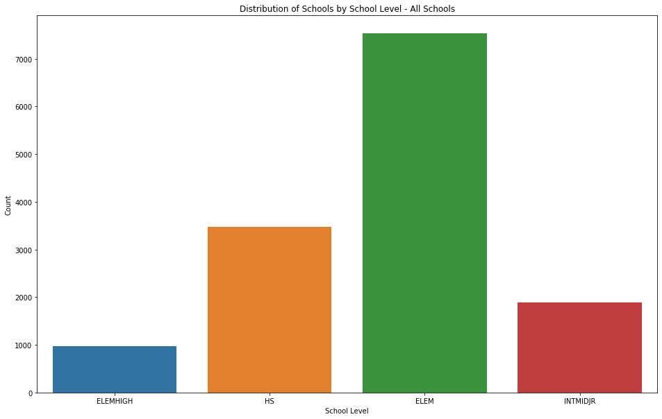


```python
sns.countplot(data=merged_df[merged_df['charter']=='Y'], x='school_level')
plt.xlabel("School Level")
plt.ylabel("Count")
plt.title("Distribution of Schools by School Level - Charter Schools")
```


    Text(0.5, 1.0, 'Distribution of Schools by School Level')


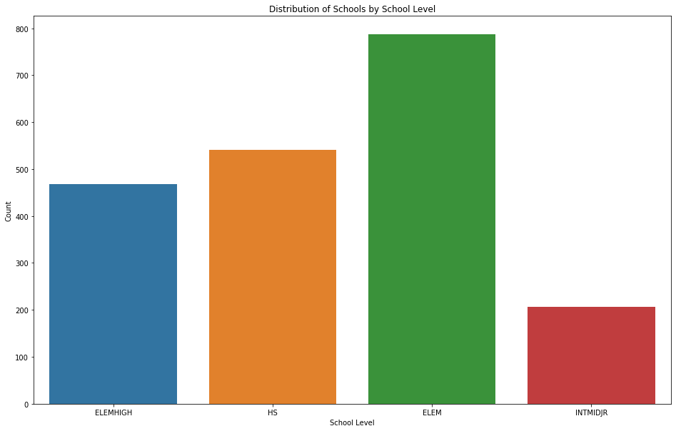


```python
sns.countplot(data=merged_df[merged_df['charter']=='N'], x='school_level')
plt.xlabel("School Level")
plt.ylabel("Count")
plt.title("Distribution of Schools by School Level - Public Schools")
```


    Text(0.5, 1.0, 'Distribution of Schools by School Level - Public Schools')


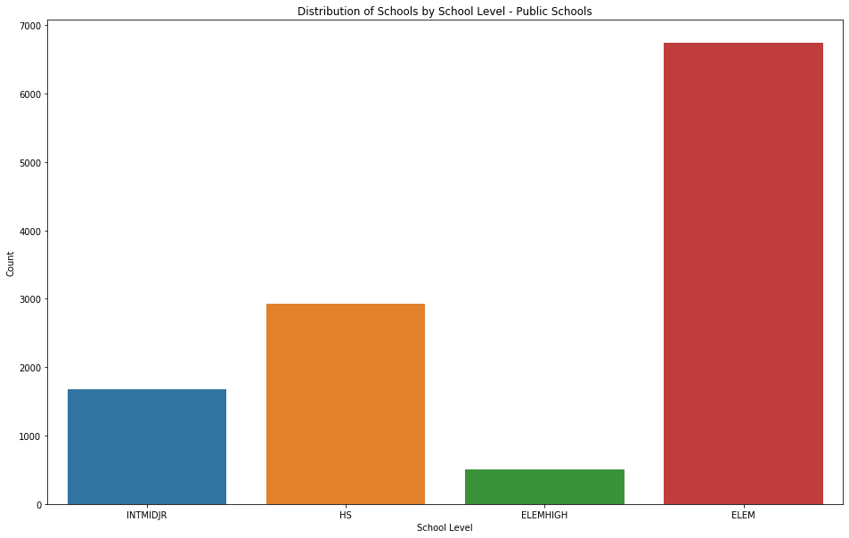


```python
schools_by_count = pd.DataFrame(merged_df.groupby('county')['cdscode'].count()).reset_index().copy()
```


```python
sns.barplot(data=schools_by_count, x='county',y='cdscode')
plt.xticks(rotation=90)
plt.xlabel("County")
plt.ylabel("Num Schools")
plt.title("Number of Schools per County")
```


    Text(0.5, 1.0, 'Number of Schools per County')


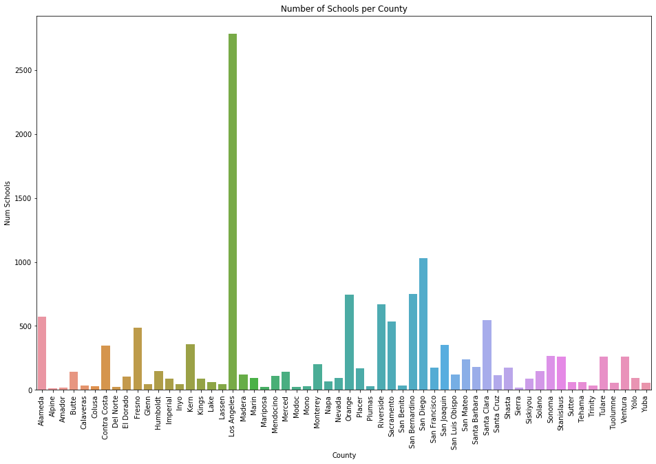


# Data Analysis

Next we will analyze the data by performing a t-test on our data to test the hypothesis that the difference in means between the two groups is equal to 0 at a 95% level of significance.

$H_o: \mu_2 - \mu_2 = 0$
<br>
$H_a: \mu_2 - \mu_2 \ne 0$

#### a. Suspension Rate

For suspension rate we will use a t-test to determine if the difference in the average school suspension rate between charter schools and public schools is statistically significant at the 95% level of significance


```python
m1 = merged_df[['charter','suspension_rate']].copy()
```


```python
m1 = m1[m1['suspension_rate'] != -9999].copy()
```


```python
rcParams['figure.figsize'] = 16, 10
sns.kdeplot(data=m1, x='suspension_rate', hue = 'charter', common_norm=False)
plt.xlabel("Suspension Rate")
plt.ylabel("Density")
plt.title("Distribution of Suspenion Rate by School Type")
```


    Text(0.5, 1.0, 'Distribution of Suspenion Rate by School Type')


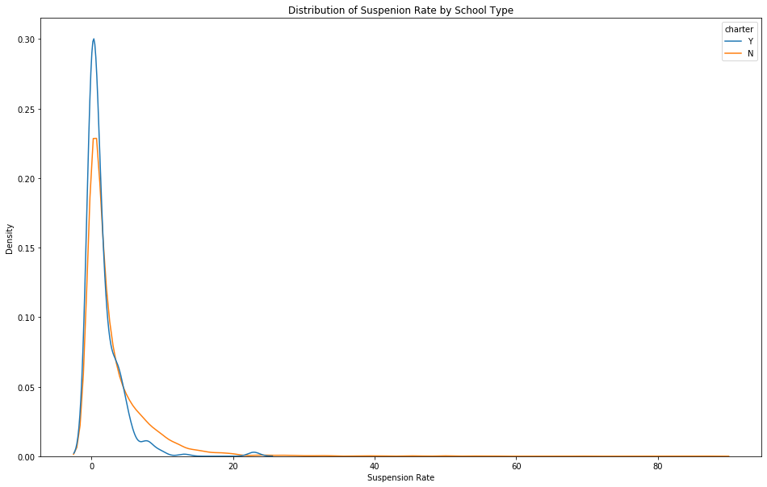


```python
rcParams['figure.figsize'] = 16, 10
sns.boxplot(data=m1, x='charter', y='suspension_rate')
plt.xlabel("School Type")
plt.ylabel("Suspension Rate")
plt.title("Suspension Rate by School Type")
```


    Text(0.5, 1.0, 'Suspension Rate by School Type')


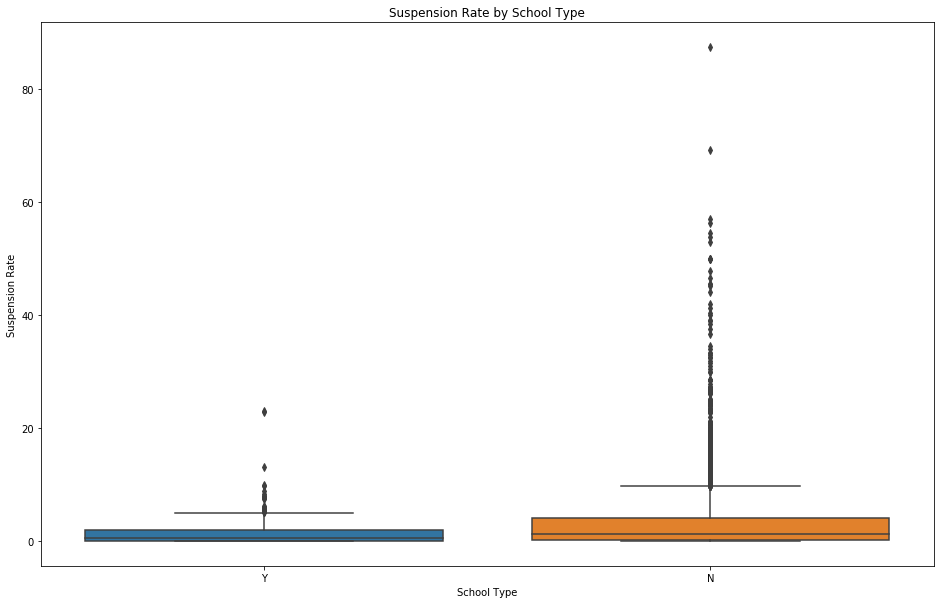


```python
m1.groupby('charter')['suspension_rate'].agg(['mean', 'count', 'std']).reset_index()
```


<div>
<style scoped>
    .dataframe tbody tr th:only-of-type {
        vertical-align: middle;
    }

    .dataframe tbody tr th {
        vertical-align: top;
    }

    .dataframe thead th {
        text-align: right;
    }
</style>
<table border="1" class="dataframe">
  <thead>
    <tr style="text-align: right;">
      <th></th>
      <th>charter</th>
      <th>mean</th>
      <th>count</th>
      <th>std</th>
    </tr>
  </thead>
  <tbody>
    <tr>
      <th>0</th>
      <td>N</td>
      <td>3.080526</td>
      <td>7297</td>
      <td>5.003553</td>
    </tr>
    <tr>
      <th>1</th>
      <td>Y</td>
      <td>1.564264</td>
      <td>333</td>
      <td>2.639736</td>
    </tr>
  </tbody>
</table>
</div>


```python
susp_charter = m1[(m1['charter']=='Y')]['suspension_rate'].copy()
susp_public = m1[(m1['charter']=='N')]['suspension_rate'].copy()

t_stat, p_value = ttest_ind(susp_charter, susp_public)
```


```python
t_stat
```


    0.4942956740879293


```python
p_value
```


    4.036024194319812e-08


At the 95% level of significance, we have enough evidence to **reject the null hypothesis** that there is no difference in the average suspension rates between charter schools and pubic schools, and therefore we accept the alternative hypothesis that there is a difference in the suspensions rates between charter schools and public schools. 

Furthermore, based on our data, we conclude that the suspension rate for charter schools is lower, and therefore better than the suspension rate at public schools. Therefore we conclude that **Charter schools perform better than public schools with respect to suspension rates**.


#### b. Graduation Rate

For graduation rate we will use a t-test to determine if the difference in the average school graduation rates between charter schools and public schools is statistically significant at the 95% level of significance


```python
m2 = merged_df[['charter','graduation_rate']].copy()
m2 = m2[m2['graduation_rate'] != -9999].copy()
```


```python
rcParams['figure.figsize'] = 16, 10
sns.kdeplot(data=m2, x='graduation_rate', hue = 'charter', common_norm=False)
plt.xlabel("Graduation Rate")
plt.ylabel("Density")
plt.title("Distribution of Graduation Rate by School Type")
```


    Text(0.5, 1.0, 'Distribution of Graduation Rate by School Type')


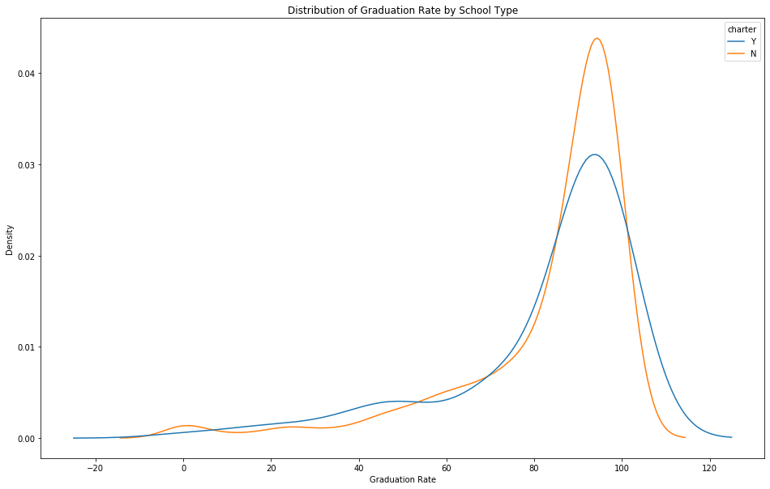


```python
rcParams['figure.figsize'] = 16, 10
sns.boxplot(data=m2, x='charter', y='graduation_rate')
plt.xlabel("School Type")
plt.ylabel("Graduation Rate")
plt.title("Graduation Rate by School Type")
```


    Text(0.5, 1.0, 'Graduation Rate by School Type')


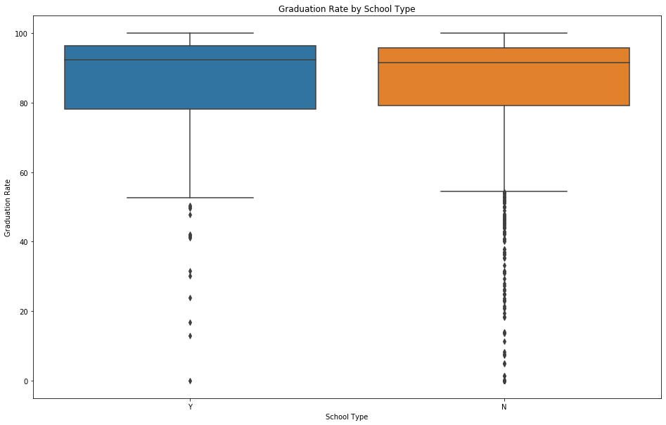


```python
m2.groupby('charter')['graduation_rate'].agg(['count','mean','std']).reset_index()
```


<div>
<style scoped>
    .dataframe tbody tr th:only-of-type {
        vertical-align: middle;
    }

    .dataframe tbody tr th {
        vertical-align: top;
    }

    .dataframe thead th {
        text-align: right;
    }
</style>
<table border="1" class="dataframe">
  <thead>
    <tr style="text-align: right;">
      <th></th>
      <th>charter</th>
      <th>count</th>
      <th>mean</th>
      <th>std</th>
    </tr>
  </thead>
  <tbody>
    <tr>
      <th>0</th>
      <td>N</td>
      <td>1293</td>
      <td>83.379892</td>
      <td>20.088917</td>
    </tr>
    <tr>
      <th>1</th>
      <td>Y</td>
      <td>113</td>
      <td>82.687611</td>
      <td>21.422927</td>
    </tr>
  </tbody>
</table>
</div>


```python
gr_charter = m2[(m2['charter']=='Y')]['graduation_rate'].copy()
gr_public = m2[(m2['charter']=='N')]['graduation_rate'].copy()

t_stat, p_value = ttest_ind(gr_charter, gr_public)
```


```python
t_stat
```


```python
p_value
```


    0.7268505910990528


At the 95% level of significance, we **do not have enough evidence to reject the null hypothesis** that there is no difference in the graduation rates between charter schools and pubic schools, and therefore we conclude that **there is no difference between public schools and charter schools with respect to graduation rates**.


#### c. Dropout Rate

For dropout rate we will use a t-test to determine if the difference in the average school dropout rate between charter schools and public schools is statistically significant at the 95% level of significance


```python
m3 = merged_df[['charter','dropout_rate']].copy()
m3 = m3[m3['dropout_rate'] != -9999].copy()
```


```python
rcParams['figure.figsize'] = 16, 10
sns.kdeplot(data=m3, x='dropout_rate', hue = 'charter', common_norm=False)
plt.xlabel("Dropout Rate")
plt.ylabel("Density")
plt.title("Distribution of Dropout Rate by School Type")
```


    Text(0.5, 1.0, 'Distribution of Dropout Rate by School Type')


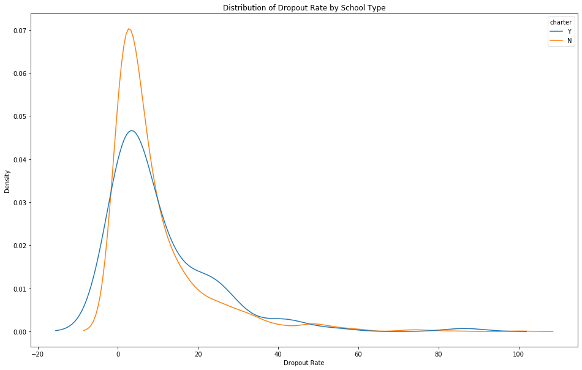


```python
rcParams['figure.figsize'] = 16, 10
sns.boxplot(data=m3, x='charter', y='dropout_rate')
plt.xlabel("School Type")
plt.ylabel("Dropout Rate")
plt.title("Dropout Rate by School Type")
```


    Text(0.5, 1.0, 'Dropout Rate by School Type')


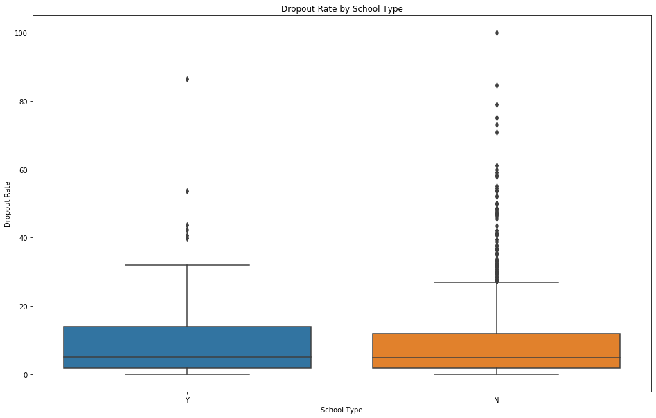


```python
m3.groupby('charter')['dropout_rate'].agg(['count','mean','std']).reset_index()
```


<div>
<style scoped>
    .dataframe tbody tr th:only-of-type {
        vertical-align: middle;
    }

    .dataframe tbody tr th {
        vertical-align: top;
    }

    .dataframe thead th {
        text-align: right;
    }
</style>
<table border="1" class="dataframe">
  <thead>
    <tr style="text-align: right;">
      <th></th>
      <th>charter</th>
      <th>count</th>
      <th>mean</th>
      <th>std</th>
    </tr>
  </thead>
  <tbody>
    <tr>
      <th>0</th>
      <td>N</td>
      <td>1293</td>
      <td>9.289791</td>
      <td>11.918480</td>
    </tr>
    <tr>
      <th>1</th>
      <td>Y</td>
      <td>113</td>
      <td>10.499115</td>
      <td>13.316803</td>
    </tr>
  </tbody>
</table>
</div>


```python
dr_charter = m3[(m3['charter']=='Y')]['dropout_rate'].copy()
dr_public = m3[(m3['charter']=='N')]['dropout_rate'].copy()

t_stat, p_value = ttest_ind(dr_charter, dr_public)
```


```python
t_stat
```


```python
p_value
```


    0.3058929859798661


At the 95% level of significance, we **do not have enough evidence to reject the null hypothesis** that there is no difference in the average dropout rates between charter schools and pubic schools, and we conclude that **there is not difference between Public schools and charter schools with respect to dropout rates**.

#### d. Chronic Absenteeism Rate

For chronic absenteeism rate we will use a t-test to determine if the difference in the average school chronic absenteeism rate between charter schools and public schools is statistically significant at the 95% level of significance


```python
m4 = merged_df[['charter','chronic_absenteeism_rate']].copy()
m4 = m4[m4['chronic_absenteeism_rate'] != -9999].copy()
```


```python
rcParams['figure.figsize'] = 16, 10
sns.kdeplot(data=m4, x='chronic_absenteeism_rate', hue = 'charter', common_norm=False)
plt.xlabel("Chronic Absensteeism Rate")
plt.ylabel("Density")
plt.title("Distribution of Chronic Absenteeism Rate by School Type")
```


    Text(0.5, 1.0, 'Distribution of Chronic Absenteeism Rate by School Type')


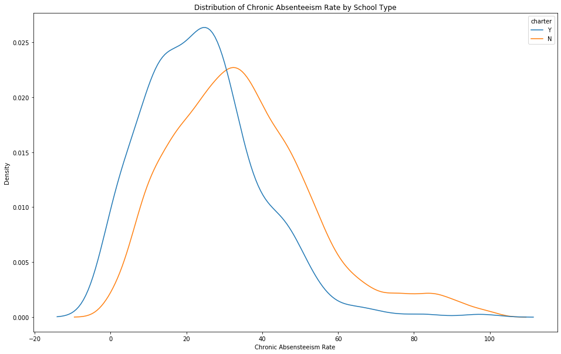


```python
rcParams['figure.figsize'] = 16, 10
sns.boxplot(data=m4, x='charter',y='chronic_absenteeism_rate')
plt.xlabel("School Type")
plt.ylabel("Chronic Absenteeism Rate")
plt.title("Chronic Absenteeism Rate by School Type")
```


    Text(0.5, 1.0, 'Chronic Absenteeism Rate by School Type')


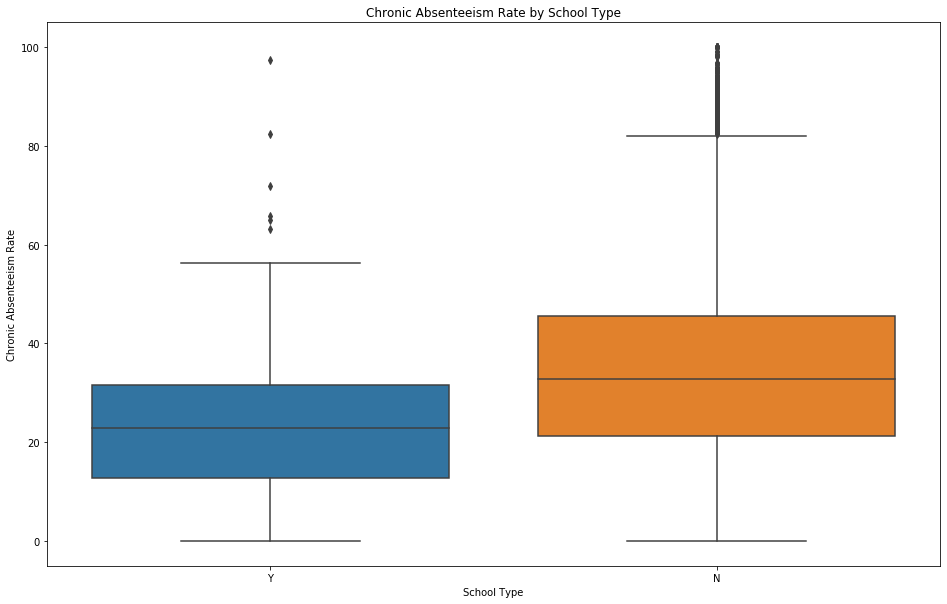


```python
m4.groupby('charter')['chronic_absenteeism_rate'].agg(['count','mean','std']).reset_index()
```


<div>
<style scoped>
    .dataframe tbody tr th:only-of-type {
        vertical-align: middle;
    }

    .dataframe tbody tr th {
        vertical-align: top;
    }

    .dataframe thead th {
        text-align: right;
    }
</style>
<table border="1" class="dataframe">
  <thead>
    <tr style="text-align: right;">
      <th></th>
      <th>charter</th>
      <th>count</th>
      <th>mean</th>
      <th>std</th>
    </tr>
  </thead>
  <tbody>
    <tr>
      <th>0</th>
      <td>N</td>
      <td>7237</td>
      <td>34.845115</td>
      <td>18.855183</td>
    </tr>
    <tr>
      <th>1</th>
      <td>Y</td>
      <td>333</td>
      <td>23.720721</td>
      <td>15.028017</td>
    </tr>
  </tbody>
</table>
</div>


```python
ca_charter = m4[(m4['charter']=='Y')]['chronic_absenteeism_rate'].copy()
ca_public = m4[(m4['charter']=='N')]['chronic_absenteeism_rate'].copy()
t_stat, p_value = ttest_ind(ca_charter, ca_public)
```


```python
t_stat
```


```python
p_value
```


    3.992697621376633e-26


At the 95% level of significance, we have enough evidence to **reject the null hypothesis** that there is no difference in the average chronic absenteeism rates between charter schools and pubic schools, and therefore we accept the alternative hypothesis that there is a difference in the average chronic absenteeism rates between charter schools and public schools. 

Furthermore, based on our data, we conclude that the chronic absenteeism rate for charter schools is lower, and therefore better than the chronic absenteeism rate at public schools. Thus, we conclude that **charter schools perform better than public schools with respect to chronic absenteeism.**

#### e. College Going Rate

For college going rate we will use a t-test to determine if the difference in the average school college going rate between charter schools and public schools (high school and elementary-high combo schools) is statistically significant at the 95% level of significance


```python
m5 = merged_df[['charter','college_going_rate']].copy()
m5 = m5[m5['college_going_rate'] != -9999].copy()
```


```python
rcParams['figure.figsize'] = 16, 10
sns.kdeplot(data=m5, x='college_going_rate', hue = 'charter', common_norm=False)
plt.xlabel("College Going Rate")
plt.ylabel("Density")
plt.title("Distribution of College Going Rate by School Type")
```


    Text(0.5, 1.0, 'Distribution of College Going Rate by School Type')


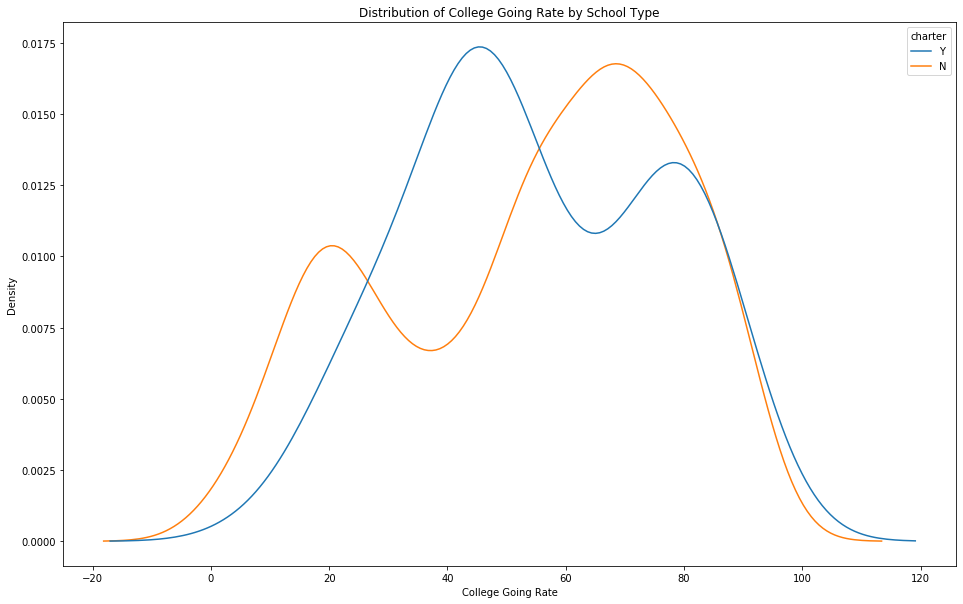


```python
sns.boxplot(data=m5, x='charter', y = 'college_going_rate')
plt.xlabel("School Type")
plt.ylabel("College Going Rate")
plt.title("College Going Rate by School Type")
```


    Text(0.5, 1.0, 'College Going Rate by School Type')


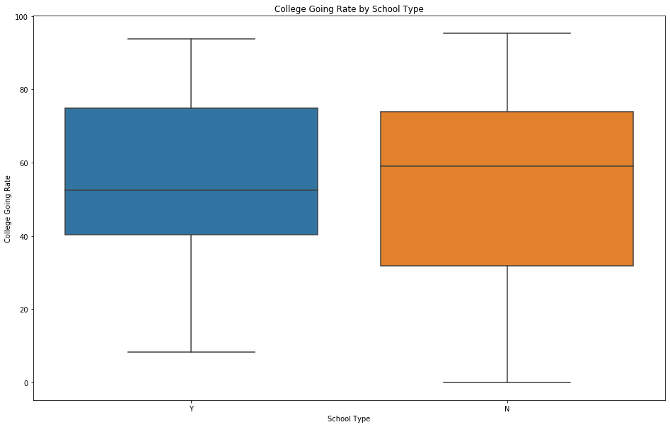


```python
m5.groupby('charter')['college_going_rate'].agg(['count','mean','std']).reset_index()
```


<div>
<style scoped>
    .dataframe tbody tr th:only-of-type {
        vertical-align: middle;
    }

    .dataframe tbody tr th {
        vertical-align: top;
    }

    .dataframe thead th {
        text-align: right;
    }
</style>
<table border="1" class="dataframe">
  <thead>
    <tr style="text-align: right;">
      <th></th>
      <th>charter</th>
      <th>count</th>
      <th>mean</th>
      <th>std</th>
    </tr>
  </thead>
  <tbody>
    <tr>
      <th>0</th>
      <td>N</td>
      <td>1120</td>
      <td>54.005089</td>
      <td>24.589240</td>
    </tr>
    <tr>
      <th>1</th>
      <td>Y</td>
      <td>102</td>
      <td>55.249020</td>
      <td>21.278678</td>
    </tr>
  </tbody>
</table>
</div>


```python
cgr_charter = m5[(m5['charter']=='Y')]['college_going_rate'].copy()
cgr_public = m5[(m5['charter']=='N')]['college_going_rate'].copy()
t_stat, p_value = ttest_ind(cgr_charter, cgr_public)
```


```python
t_stat
```


    0.4942956740879293


```python
p_value
```


    0.6211863678991392


At the 95% level of significance, we are **unable to reject the null hypothesis**, and therefore we conclude that **there is no difference between Charter schools and Public Schools with respect to college going rates**

# Conclusion

Across each of the categories that we used to compare the performance of charter schools vs. public schools, we find that charter schools outperformed public schools in 2 of the 5 categories, while public schools did not outperform charter schools in any of the categories

Based on these results, we would conclude that **charter schools are better than public schools in California.** 

However, there are several known limitations with using this analysis to determine if charter schools are better than public schools. Some of these limitations include:  

1. Based on the way we summarized the results from each of the different categories of analysis, we essentially are concluding that each category is equally-weighted for the purposes of calculating our overall ranking. While it's possible that an individual interested in comparing the two school types may agree that each of these categories are qualitatively the same in terms of their choice, additional research should be done to come to this conclusion.

2. Additionally, there are a number of other features that can and should be used to measure the differences between public and charter schools. Amongst them include: performance on standardized tests, extra-curriculur activities, diversity of staff, student diversity. Although one could argue that the performance in each of these other areas would show up in areas such as graduation rates and college-going rates, it's still worth noting that they are absent in our evaluation tool.

3. Finally, this analysis was based on relative performance between school types for all student. However, this doesn't take into account the fact that one of the missions of charter schools is often focused on beting a better option for undermarginalized populations. As a result, it's possible that if we were to further evaluate performance amongst different sub-cohorts of student populations, we may generate a different conclusion. 

Overall, I believe that this research project allows us to recognize that there are clear differences between charter schools and public schools, and therefore is a research question worthy of additional analysis and investigation.

# Appendix

The documentation for each of the datasets are located here

1. Public Schools and Districts - https://www.cde.ca.gov/ds/si/ds/fspubschls.asp
2. Chronic Absenteeism - https://www.cde.ca.gov/ds/ad/fsabd.asp
3. Suspensions - https://www.cde.ca.gov/ds/ad/fssd.asp
4. Dropout - https://www.cde.ca.gov/ds/ad/fsacgr.asp
5. Post-Secondary Enrollment - https://www.cde.ca.gov/ds/ad/fscgr16.asp
